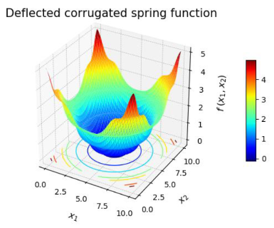

 

A collection of continous functions ([coded in Python](https://github.com/edgarsmdn/OptiFunctions)) with known minimum to test optimization algorithms. They have been grouped into 6 major classes:
* Plane-shaped
* Bowl-shaped
* Many local minima
* Plate-shaped
* Valley-shaped 
* Others

