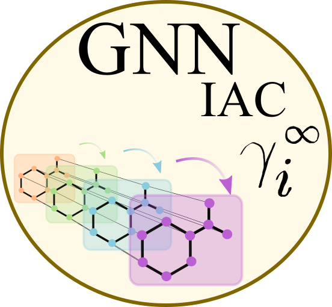

A GNN model that predicts isothermal infinite dilution activity coefficients. The [code](https://github.com/edgarsmdn/GNN_IAC) contains the training routines and the experiments presented in the paper [Graph Neural Networks for the prediction of infinite dilution activity coefficients](https://pubs.rsc.org/en/content/articlelanding/2022/DD/D1DD00037C).

To cite this work:

```
@Article{sanchez_medina_GNN_2022,
author ="Sanchez Medina, Edgar Ivan and Linke, Steffen and Stoll, Martin and Sundmacher, Kai",
title  ="Graph neural networks for the prediction of infinite dilution activity coefficients",
journal  ="Digital Discovery",
year  ="2022",
volume  ="1",
issue  ="3",
pages  ="216-225",
publisher  ="RSC",
doi  ="10.1039/D1DD00037C",
url  ="http://dx.doi.org/10.1039/D1DD00037C"}

```
