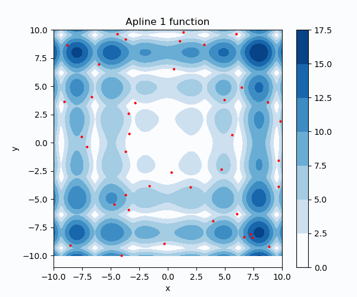

Several stochastic optimization methods (coded in Python) for derivative-free optimization of functions of n-dimensions.
The specific algorithms are:
* [Particle Swarm Optimization](https://github.com/edgarsmdn/PSO)
* [Simulated Annealing](https://github.com/edgarsmdn/SA)
* [Tabu Search](https://github.com/edgarsmdn/TS)
* [Genetic Algorithm](https://github.com/edgarsmdn/GA)
